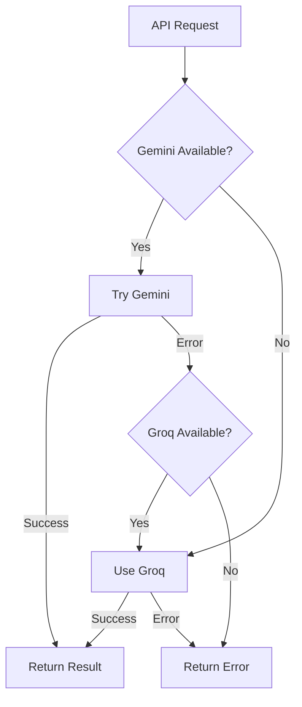

# AI Provider Guide - Groq Fallback

## Overview

QuantumCV now supports **automatic AI provider fallback**. The system tries Google Gemini first, and if it fails, automatically falls back to Groq AI. This ensures high availability and reliability for all AI-powered features.

## Features That Use AI

1. **Resume Generation** - AI-powered resume formatting and optimization
2. **Cover Letter Generation** - Personalized cover letter writing
3. **Resume Parsing** - Extract structured data from uploaded resumes
4. **AI Suggestions** - Real-time content improvement suggestions
5. **ATS Optimization** - Keyword matching and scoring

## AI Providers

### Primary: Google Gemini (Gemini 1.5 Pro)

**Pros:**
- State-of-the-art performance
- Large context window (1M tokens)
- Excellent for complex tasks

**Cons:**
- Paid service (requires billing account)
- Rate limits apply
- May experience occasional downtime

**Setup:**
1. Go to [Google AI Studio](https://makersuite.google.com/app/apikey)
2. Create an API key
3. Add to `.env.local`:
   ```bash
   GOOGLE_API_KEY=your_gemini_api_key_here
   GEMINI_MODEL=gemini-1.5-pro-latest
   ```

### Fallback: Groq (Llama 3.3 70B)

**Pros:**
- **FREE** with generous limits
- **Extremely fast** inference (fastest in the market)
- High-quality open-source models
- No credit card required

**Cons:**
- Slightly lower quality than Gemini for complex tasks
- Smaller context window (8K-32K tokens depending on model)

**Setup:**
1. Go to [Groq Console](https://console.groq.com/keys)
2. Sign up (free, no credit card)
3. Create an API key
4. Add to `.env.local`:
   ```bash
   GROQ_API_KEY=your_groq_api_key_here
   GROQ_MODEL=llama-3.3-70b-versatile
   ```

## Available Groq Models

| Model | Parameters | Context | Speed | Use Case |
|-------|-----------|---------|-------|----------|
| `llama-3.3-70b-versatile` | 70B | 8K | Fast | **Recommended** - Best balance |
| `mixtral-8x7b-32768` | 47B | 32K | Fast | Large documents |
| `llama-3.1-8b-instant` | 8B | 8K | Very Fast | Quick responses |
| `gemma2-9b-it` | 9B | 8K | Fast | Instruction following |

**Recommendation:** Use `llama-3.3-70b-versatile` for the best quality-to-speed ratio.

## Configuration Options

### Option 1: Both Providers (Recommended)

Maximum reliability with automatic fallback:

```bash
# .env.local
GOOGLE_API_KEY=your_gemini_key
GEMINI_MODEL=gemini-1.5-pro-latest

GROQ_API_KEY=your_groq_key
GROQ_MODEL=llama-3.3-70b-versatile
```

**Behavior:**
- ✅ Tries Gemini first (best quality)
- ✅ Falls back to Groq if Gemini fails
- ✅ Always available (redundancy)

### Option 2: Gemini Only

Use only Google Gemini (no fallback):

```bash
# .env.local
GOOGLE_API_KEY=your_gemini_key
GEMINI_MODEL=gemini-1.5-pro-latest
```

**Behavior:**
- ✅ Uses Gemini for all requests
- ❌ No fallback if Gemini is down

### Option 3: Groq Only (Free Alternative)

Use only Groq (completely free):

```bash
# .env.local
GROQ_API_KEY=your_groq_key
GROQ_MODEL=llama-3.3-70b-versatile
```

**Behavior:**
- ✅ Completely free operation
- ✅ Very fast responses
- ⚠️ Slightly lower quality than Gemini

## How Fallback Works

The system automatically handles provider failover:



**Example Flow:**

1. User generates a resume
2. System tries Gemini first
3. If Gemini fails (rate limit, downtime, etc.), system automatically retries with Groq
4. User gets result without noticing the failover

## Logging

The system logs which provider is being used:

```
✓ Gemini AI initialized
✓ Groq AI initialized (model: llama-3.3-70b-versatile)
🚀 Attempting generation with Gemini...
✓ Gemini generation successful
```

If fallback occurs:

```
✓ Gemini AI initialized
✓ Groq AI initialized (model: llama-3.3-70b-versatile)
🚀 Attempting generation with Gemini...
⚠ Gemini failed: Rate limit exceeded
🔄 Falling back to Groq...
🚀 Attempting generation with Groq (llama-3.3-70b-versatile)...
✓ Groq generation successful
```

## Cost Comparison

| Provider | Free Tier | Paid Pricing | Notes |
|----------|-----------|-------------|-------|
| **Gemini** | Limited | ~$0.0025/1K input tokens | Requires billing account |
| **Groq** | Generous | Free (for now) | No credit card required |

**Monthly Estimates (1000 resumes):**
- Gemini only: ~$5-10/month
- Groq only: **$0/month**
- Both (with fallback): ~$3-7/month (Gemini handles most, Groq as backup)

## Testing Fallback

To test if fallback is working:

1. **Disable Gemini temporarily:**
   ```bash
   # Comment out in .env.local
   # GOOGLE_API_KEY=your_gemini_key
   ```

2. **Make a request** (generate resume, parse resume, etc.)

3. **Check logs** - should see:
   ```
   ✓ Groq AI initialized
   🚀 Attempting generation with Groq...
   ✓ Groq generation successful
   ```

4. **Re-enable Gemini** and verify it's used first again

## Troubleshooting

### Error: "No AI providers available"

**Problem:** Neither Gemini nor Groq API keys are set.

**Solution:** Add at least one API key to `.env.local`:
```bash
GROQ_API_KEY=your_groq_key  # Easiest - completely free
```

### Error: "All AI providers failed"

**Problem:** Both providers returned errors.

**Solutions:**
1. Check API keys are valid
2. Check rate limits
3. Check internet connection
4. Try different models

### Groq Rate Limiting

**Free Tier Limits:**
- 30 requests/minute
- 14,400 requests/day

**Solution:** Use both providers - Gemini as primary, Groq as fallback.

### Quality Differences

If you notice quality differences between providers:

1. **Gemini is generally better** for:
   - Complex resume parsing
   - Creative cover letters
   - Detailed suggestions

2. **Groq (Llama 3.3 70B) is excellent** for:
   - Resume formatting
   - Keyword extraction
   - Quick suggestions
   - Most standard tasks

## Best Practices

1. **Use Both Providers:**
   - Set up both Gemini and Groq
   - Gemini as primary for quality
   - Groq as fallback for reliability

2. **Monitor Usage:**
   - Check logs to see which provider is used
   - Monitor costs if using paid tiers
   - Adjust based on your needs

3. **Start Free:**
   - Begin with Groq only (completely free)
   - Add Gemini later if you need higher quality
   - Keep Groq as fallback for reliability

4. **Model Selection:**
   - For Groq, use `llama-3.3-70b-versatile` (best balance)
   - For Gemini, use `gemini-1.5-pro-latest` (latest features)

## Support

For issues or questions:
- Check logs for error messages
- Verify API keys are correct
- Ensure at least one provider is configured
- Test each provider individually

## Additional Resources

- [Groq Documentation](https://console.groq.com/docs)
- [Groq API Keys](https://console.groq.com/keys)
- [Google Gemini API](https://makersuite.google.com/app/apikey)
- [Gemini Pricing](https://ai.google.dev/pricing)

---

**TL;DR:** Set up Groq (free) as your fallback provider for 100% uptime. QuantumCV will automatically switch between providers to ensure your resume generation never fails.
