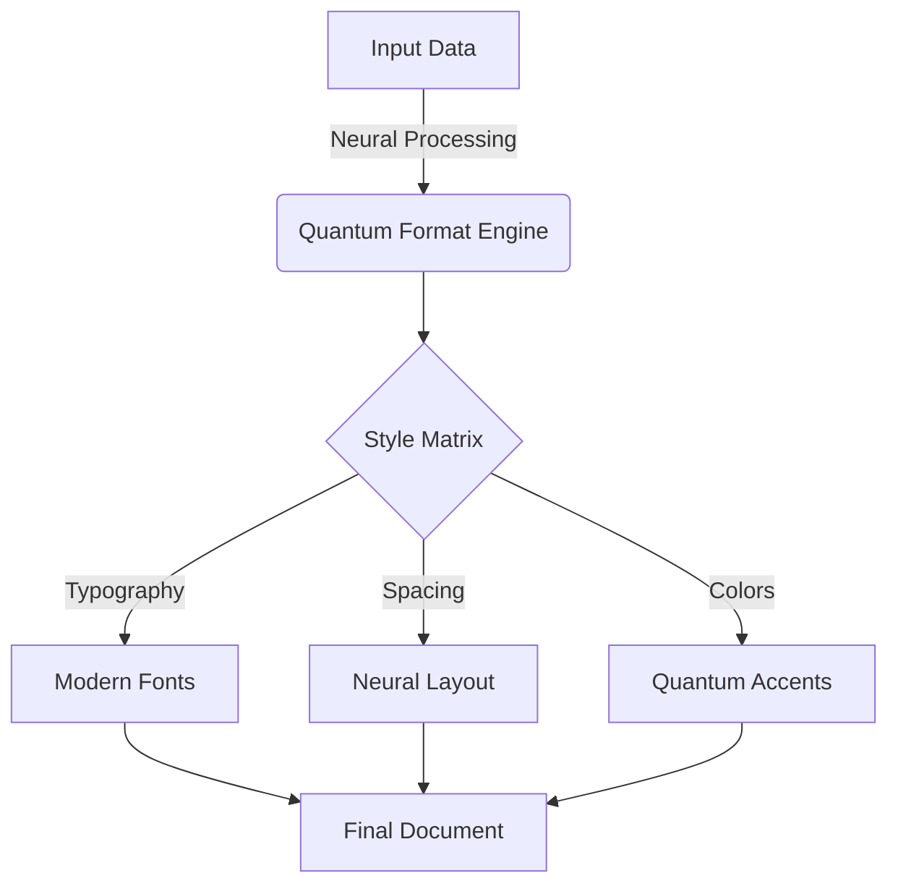

<div align="center">


# 🌌 QuantumCV | Next-Gen Document Generator 3000

<div style="background: linear-gradient(45deg, #00f2fe, #4facfe); padding: 20px; border-radius: 10px; margin: 20px 0;">

[](https://nodejs.org)
[](https://ai.google.dev/)
[](LICENSE)
[](https://github.com/ShalomObongo/quantumcv/graphs/commit-activity)

</div>

### 🚀 Creating Tomorrow's Documents, Today

<div style="background: #000000; padding: 20px; border-radius: 10px; margin: 20px 0;">

</div>

</div>

---

<div align="center">

## 🌟 Quantum Features Matrix

</div>

<table align="center">
<tr>
<td align="center" width="33%">

<br/>
<b>Neural Document Generation</b>
<br/>
Harness Gemini Pro's quantum AI
</td>
<td align="center" width="33%">

<br/>
<b>Adaptive Formatting</b>
<br/>
Self-optimizing layouts
</td>
<td align="center" width="33%">

<br/>
<b>Job-Specific Optimization</b>
<br/>
Real-time content adaptation
</td>
</tr>
<tr>
<td align="center">

<br/>
<b>Quantum Styling</b>
<br/>
Next-gen visual aesthetics
</td>
<td align="center">

<br/>
<b>ATS Enhancement</b>
<br/>
AI-powered optimization
</td>
<td align="center">

<br/>
<b>CLI Interface</b>
<br/>
Holographic command center
</td>
</tr>
</table>

---

<div align="center">

## 🚀 Quantum Installation Protocol

</div>

```bash
# Clone the quantum repository
git clone https://github.com/yourusername/quantumcv.git

# Initialize quantum space
cd quantumcv

# Synchronize dependencies
npm install

# Configure quantum parameters
cp .env.example .env

# Launch the quantum core
node CVandCLbuilder.jsx
```

---

<div align="center">

## 🌌 System Requirements

</div>

<table align="center">
<tr>
<td>
 Node.js
</td>
<td>v14.0.0+</td>
</tr>
<tr>
<td>
 Gemini Pro API
</td>
<td>Active Key</td>
</tr>
<tr>
<td>
 Resume Data
</td>
<td>Text Format</td>
</tr>
</table>

---

<div align="center">

## 🎮 Command Center Interface

</div>

### 🌟 Launch Sequence
```bash
node CVandCLbuilder.jsx
```

### 🎯 Operation Protocols
1. 🌠 **Quantum Resume Generation**
   - Neural network processing
   - Real-time optimization
   - Multi-dimensional formatting

2. ⚡ **Neural Cover Letter Synthesis**
   - AI-powered content generation
   - Dynamic job alignment
   - Quantum personality injection

3. 🔮 **Full Spectrum Generation**
   - Complete document suite
   - Synchronized styling
   - Holistic optimization

---

<div align="center">

## 🌈 Document Matrix

</div>

### 📑 Quantum Resume
- Dual-column quantum architecture
- Neural network content organization
- Hyperspace link integration
- Quantum visual hierarchy

### 📝 Neural Cover Letter
- AI-driven narrative synthesis
- Dynamic content adaptation
- Quantum formatting engine
- Neural personality integration

---

<div align="center">

## 🎨 Quantum Styling Framework

</div>



---

<div align="center">

## 🔧 Quantum Configuration

</div>

### 🌌 Environment Matrix
```env
GOOGLE_API_KEY=your_quantum_key_here
```

### 🛸 Core Dependencies
- @google/generative-ai: Neural core
- pdfkit: Quantum document engine
- chalk & chalk-animation: Holographic UI
- figlet: ASCII quantum renderer
- boxen: Terminal quantum fields
- ora: Quantum spinners

---

<div align="center">

## 🤝 Quantum Collaboration Protocol

</div>

1. 🌌 Fork the quantum realm
2. 🚀 Create your feature branch (`git checkout -b feature/QuantumFeature`)
3. 💫 Commit your changes (`git commit -m 'Add QuantumFeature'`)
4. 🌠 Push to the branch (`git push origin feature/QuantumFeature`)
5. 🎯 Open a Quantum Pull Request

---

<div align="center">

## 🔮 Quantum Troubleshooting Matrix

</div>

<details>
<summary>🌋 API Quantum Fluctuations</summary>

- Verify quantum key configuration
- Check neural network connectivity
- Validate quantum environment variables
</details>

<details>
<summary>🌊 Document Generation Anomalies</summary>

- Check quantum permissions
- Verify data format integrity
- Monitor quantum storage capacity
</details>

<details>
<summary>🌪️ Dependency Distortions</summary>

- Reinitialize quantum packages
- Clear quantum cache
- Verify quantum compatibility
</details>

---

<div align="center">

## 📜 Quantum License

This project exists in the ISC quantum realm - see the [LICENSE](LICENSE) file for details.

## 🙏 Quantum Acknowledgments

- Google Gemini Pro Neural Core
- PDFKit Quantum Engine
- The Open-Source Quantum Community

---

**[📚 Documentation](docs/index.md)** • **[🐛 Report Anomaly](issues)** • **[✨ Request Quantum Feature](issues)**

<br/>

<div style="background: linear-gradient(45deg, #00f2fe, #4facfe); padding: 10px; border-radius: 5px;">

Made with 🧠 by [Shalom-King](https://github.com/ShalomObongo)

</div>

</div>